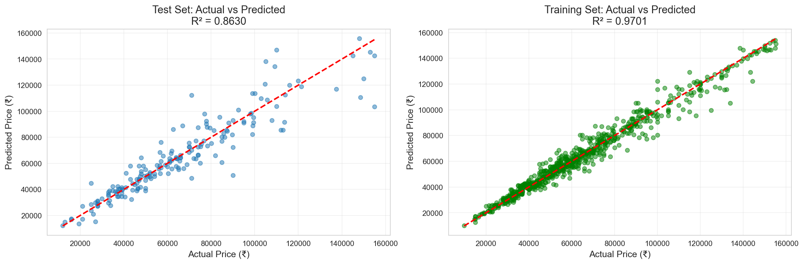
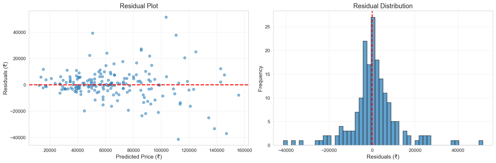

# 💻 Laptop Price Predictor

A **Machine Learning Web Application** that predicts laptop prices based on specifications such as brand, RAM, processor type, storage, and other features.  
The model is trained using regression techniques and deployed with a simple Flask web interface.

---

## 🚀 Project Overview

This project helps users estimate the **market price of a laptop** based on various input specifications.  
It combines **data preprocessing**, **feature engineering**, and **Gradient Boosting Regression** to provide accurate predictions.

---

## 🧠 Model & Approach

1. **Data Cleaning & Preprocessing**  
   - Handled missing values and outliers  
   - Encoded categorical variables  
   - Normalized numerical features  

2. **Model Training**  
   - Used **Gradient Boosting Regressor** for optimal performance  
   - Evaluated using **MAE**, **RMSE**, and **MAPE** metrics  

3. **Visualization & Analysis**  
   The model’s performance and feature contributions were visualized using several plots.

---

## 📊 Visual Results

### 🔹 Feature Importance
Shows which features have the greatest impact on laptop price prediction.


---

### 🔹 Prediction Comparison
Displays how closely the model’s predictions match the actual prices.



---

### 🔹 Residual Analysis
Helps analyze the distribution of prediction errors to check model reliability.



---

## 🧩 Project Structure

```
📁 Laptop Price Predictor
│
├── app.py                     # Flask web app for deployment
├── predict_model.py           # Loads model and predicts price
├── train_model.py             # Trains and saves the ML model
├── laptops.csv                # Dataset used for training
├── index.html                 # Frontend for user input
├── laptop_price_model.pkl     # Trained model
├── feature_importance.png     # Visualization of important features
├── prediction_comparison.png  # Predicted vs Actual results
├── residual_analysis.png      # Residual plot
└── venv/                      # Virtual environment (ignored in Git)
```

---

## ⚙️ Installation & Setup

### 1️⃣ Clone the Repository
```bash
git clone https://github.com/your-username/laptop-price-predictor.git
cd laptop-price-predictor
```

### 2️⃣ Create Virtual Environment
```bash
python -m venv venv
venv\Scripts\activate   # On Windows
source venv/bin/activate  # On macOS/Linux
```

### 3️⃣ Install Dependencies
```bash
pip install -r requirements.txt
```

### 4️⃣ Run the App
```bash
python app.py
```

Then open your browser and go to:
```
http://127.0.0.1:5000
```

---

## 🌐 Deployment
You can deploy the Flask app easily on:
- **Render**
- **Railway**
- **Vercel (via API route)**
- **Heroku** (legacy option)

Make sure your `requirements.txt` and `Procfile` are correctly configured.

---

## 📈 Evaluation Metrics

| Metric | Description | Purpose |
|--------|--------------|---------|
| **MAE** | Mean Absolute Error | Measures average prediction error |
| **RMSE** | Root Mean Squared Error | Penalizes large errors more |
| **MAPE** | Mean Absolute Percentage Error | Useful for better interpretability |

---

## 🧰 Tech Stack

**Languages & Frameworks:**  
- Python, HTML, Flask  

**Libraries:**  
- pandas, numpy, scikit-learn, matplotlib, seaborn  

**Tools:**  
- VS Code, GitHub, Jupyter Notebook  

---

## 👨‍💻 Author

**Vishesh Kumar**  
Student | AI & ML Enthusiast  
📧 [evishesh7.com]  
🌐 [LinkedIn Profile](https://www.linkedin.com/in/vishesh-kumar-9b37382ba)  

---

## 📜 License

This project is licensed under the **MIT License** — feel free to use and modify it as needed.

---

⭐ *If you found this helpful, don’t forget to star the repo!*
